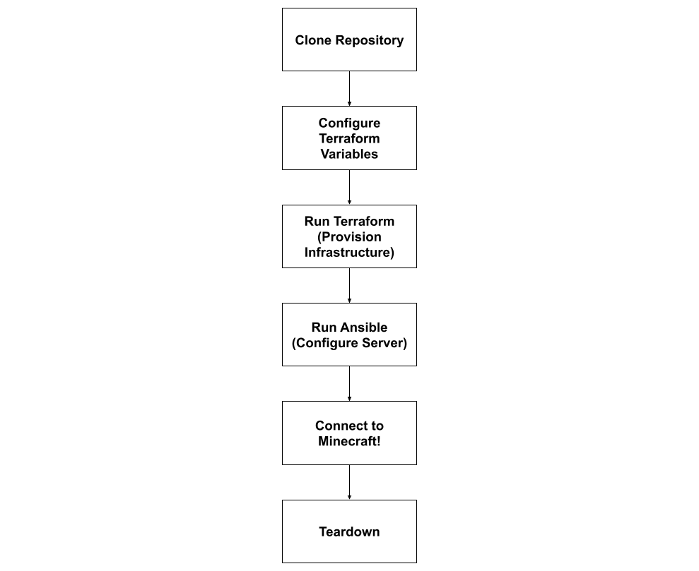

# Acme Corp Minecraft Server Automation

## Background

This repository describes how to set up a Minecraft server on an AWS EC2 instance for the fictional Acme Corp. We use Terraform and Ansible to automate the process. Terraform provisions networking and compute resources, and Ansible installs Corretto 21 (Java 21), downloads Minecraft 1.21.5, and configures a systemd service to manage the server. Best of all, everything is done without using the AWS Management Console!

## Requirements

* **AWS CLI v2**

  * *Note:* Configure the CLI with your Access Key, Secret Access Key, Session Token, and Region. You can obtain these credentials from the AWS Learn Lab Module.
  * Set them as environment variables:

    ```bash
    export AWS_ACCESS_KEY_ID=<your-access-key-id>
    export AWS_SECRET_ACCESS_KEY=<your-secret-access-key>
    export AWS_SESSION_TOKEN=<your-session-token>
    export AWS_REGION=<your-region>
    ```
* **WSL (Ubuntu)** or any Unix-like shell with:

  * Terraform (>= 1.0)
  * Ansible (>= 2.9)
* **SSH key pair**: A private key at `~/.ssh/acme-minecraft-key.pem` and a matching public key imported into AWS as `acme-minecraft-key`.

  * To generate the key pair:

    ```bash
    ssh-keygen -t rsa acme-minecraft-key.pem
    ```
  * To import the public key into AWS:

    ```bash
    aws ec2 import-key-pair --key-name acme-minecraft-key \
      --public-key-material fileb://~/.ssh/acme-minecraft-key.pem.pub
    ```

## Diagram of Steps



## Setup & Deployment

### 1. Clone the Repository

```bash
git clone git@github.com:alanakihn/cs312-project2.git
cd cs312-project2
```

### 2. Configure Terraform Variables

Edit `terraform/variables.tf.example` to contain your variables:

```bash
cd terraform
cp variables.tf.example variables.tf
vim variables.tf
```

### 3. Provision Infrastructure

```bash
terraform init
terraform apply -var-file=variables.tf -auto-approve
```

Terraform creates a VPC, subnet, Internet gateway, security group (SSH & port 25565), and an EC2 instance. When complete, note the `minecraft_public_ip` output.

### 4. Configure the Server with Ansible

Return to the project root:

```bash
cd ..
```

Copy the inventory example and update it:

```bash
cp inventory/hosts.example inventory/hosts
vim inventory/hosts
```

* Replace `<minecraft_public_ip>` with the EC2 public IP.
* Ensure the `ansible_ssh_private_key_file` path is `~/.ssh/acme-minecraft-key.pem`.

Run the playbook:

```bash
ansible-playbook -i inventory/hosts playbooks/setup-minecraft.yml
```

Ansible installs Corretto 21, downloads Minecraft 1.21.5, and enables a systemd service for Minecraft.

### 5. Connect to the Minecraft Server

* **Nmap**: Verify the server port is open:

  ```bash
  nmap -sV -Pn -p T:25565 <minecraft_public_ip>
  ```
* **Minecraft Client**: Launch Minecraft and enter `<minecraft_public_ip>` as the server address. 

  Happy gaming!

## Teardown

To destroy all resources:

```bash
cd terraform
terraform destroy -var-file=variables.tf.example -auto-approve
```

## References

* Terraform AWS Provider: [https://registry.terraform.io/providers/hashicorp/aws](https://registry.terraform.io/providers/hashicorp/aws)
* Ansible Documentation: [https://docs.ansible.com/](https://docs.ansible.com/)
* Minecraft Server Download: [https://www.minecraft.net/en-us/download/server](https://www.minecraft.net/en-us/download/server)
* An LLM was used to assist in debugging Terraform files and Ansible Playbook
